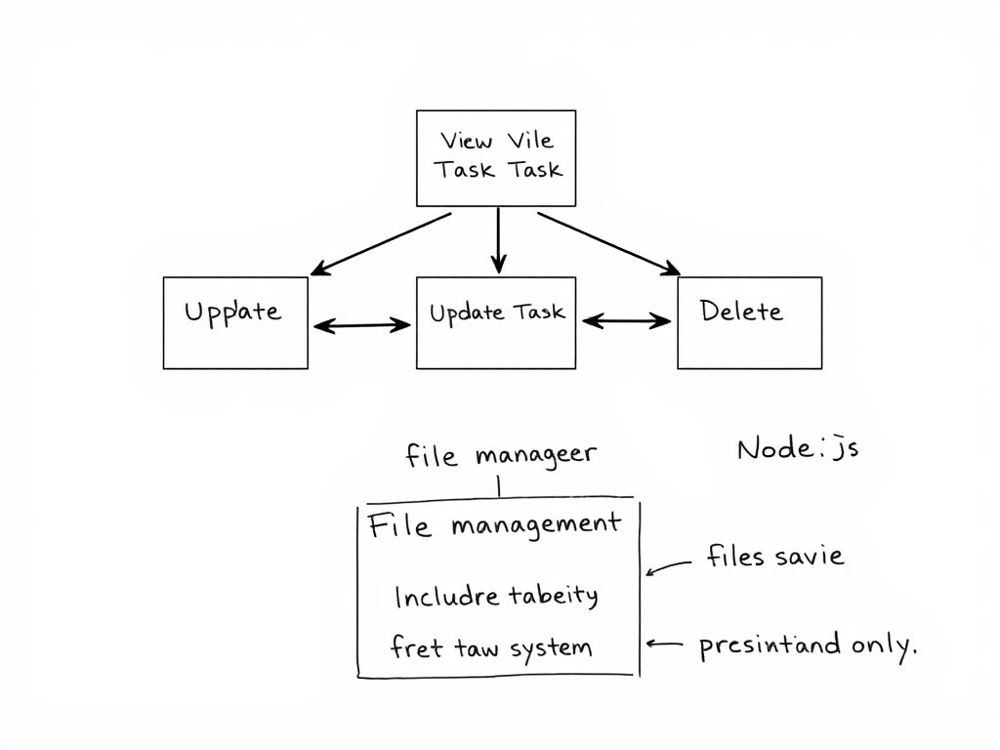
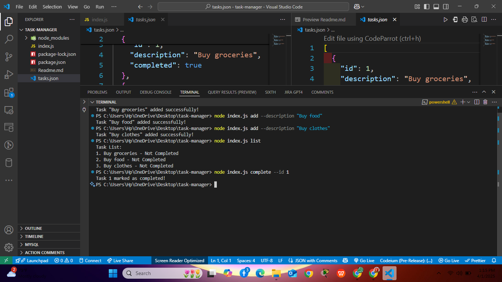

# Task Manager using OOP and File Management

## Description
This is a command-line Task Manager application built using **Node.js** and **Object-Oriented Programming (OOP)** principles in **JavaScript**. The application allows users to efficiently manage tasks by providing functionalities to **add, view, update, and delete tasks**. To ensure data persistence, tasks are stored in a file using **file management techniques**.

## Features
- **Add a Task**: Users can create a new task with a title, description, and status.
- **View Tasks**: Display all tasks stored in the system.
- **Update a Task**: Modify an existing task's details.
- **Delete a Task**: Remove a task from the system.
- **Persistent Storage**: All tasks are saved in a file, ensuring data retention across sessions.

## Technologies Used
- **Node.js**: JavaScript runtime for executing code.
- **File System (fs) Module**: Handles reading and writing of task data.
- **OOP Principles**: Encapsulation, inheritance, and abstraction for structured code.

## Installation
1. Ensure you have **Node.js** installed on your system.
2. Clone the repository:
   ```sh
   git clone https://github.com/your-username/task-manager.git
   ```
3. Navigate to the project directory:
   ```sh
   cd task-manager
   ```
4. Install dependencies (if any):
   ```sh
   npm install
   ```

## Usage
1. Run the application:
   ```sh
   node index.js
   ```
2. Follow the command prompts to manage tasks.

## File Structure
```
/task-manager
│── index.js            # Entry point of the application
│── taskManager.js      # Main class handling task operations
│── tasks.json          # JSON file for storing tasks persistently
│── package.json        # Project metadata and dependencies
│── Readme.md           # Project documentation

## Future Enhancements
- Implement a **database storage** option (e.g., MongoDB, SQLite).
- Add **task priority levels**.
- Introduce a **task due date feature**.
- Build a **CLI interface using Inquirer.js** for better user interaction.

## Contributing
Feel free to contribute by submitting issues or pull requests. 

## License
This project is licensed under the **MIT License**.
